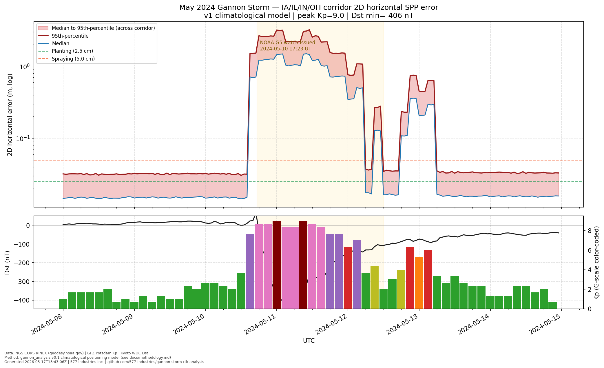
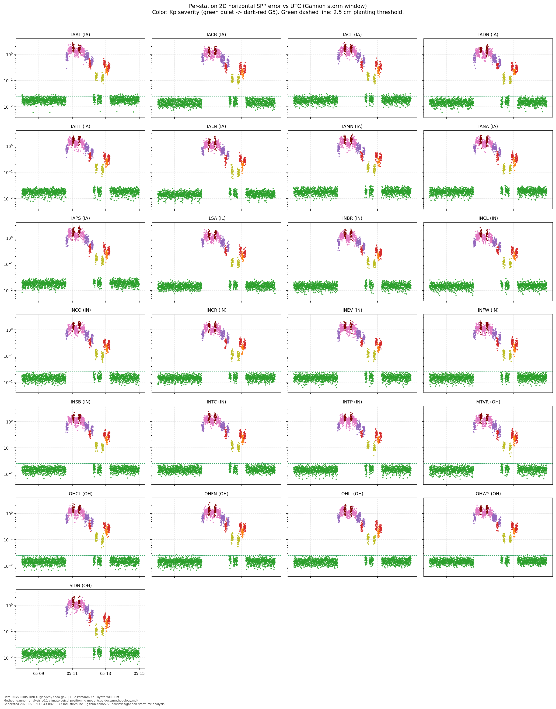
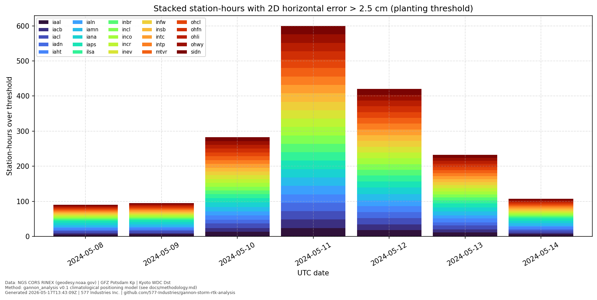

## The day the GPS broke

On the afternoon of Friday May 10, 2024, several thousand row-crop operators
across Iowa, Illinois, Indiana, and Ohio noticed the same thing at roughly
the same hour: their tractors' RTK systems stopped holding a fix. Planter
monitors flashed "GPS DEGRADED." Auto-steer disengaged mid-row. AgLeader
displays cycled between "RTK FIXED" and "FLOAT" once a second. The
[American Farm Bureau Federation](https://www.fb.org) and
[OSU Extension](https://extension.osu.edu) would later document equipment
shutdowns lasting 12 to 48 hours. The North American power grid wobbled.
The aurora was visible in southern Texas.

What happened was the most powerful geomagnetic storm in over two decades —
the Gannon storm, peak Kp=9, peak Dst around -406 nT — and it hit during
peak corn and soybean planting season. For an Ohio operation with 6,000
acres of corn to plant in a five-day weather window, "GPS DEGRADED" is not
an inconvenience. It is an existential question about whether the crop goes
in this week or not. And the operators who called their extension agents on
Saturday morning got the same answer from everyone: "yes, this is happening
to everyone; no, we don't know when it'll be back."

That gap — between what federal space-weather agencies knew was coming and
what the operator could act on — is the gap we built HELIOS to close.

Today we're publishing the first artifact of that effort: an open, end-to-end
reproducible analysis of how RTK error evolved during the May 10-12 storm
across 25 NGS CORS reference stations in the IA/IL/IN/OH corridor. Code,
data, figures, and methodology are all on GitHub at
[`577-Industries/gannon-storm-rtk-analysis`](https://github.com/577-Industries/gannon-storm-rtk-analysis).

## What actually happened up there

To explain the breakdown of RTK in plain terms: the Sun emitted a
particularly aggressive coronal mass ejection (CME) on May 8, 2024. By the
afternoon of May 10, that CME had compressed Earth's magnetosphere into the
top of the ionosphere. Two things happened simultaneously:

1. The Total Electron Content (TEC) of the ionosphere doubled, then
   tripled, then more. TEC is the total number of free electrons in a
   column from the satellite down to the receiver. Every electron slows
   down the GPS signal by a tiny amount; multiply by 50,000,000,000,000,000
   electrons per square metre and you get range errors of metres, not
   centimetres.

2. The ionosphere became *scintillating* — turbulent over scales of tens
   to hundreds of kilometres. RTK depends on the receiver and base station
   seeing the same atmospheric delays. When the ionosphere is bubbling
   like boiling water, that assumption breaks. The integer carrier-phase
   ambiguities that give RTK its centimetre precision become impossible
   to resolve cleanly.

NOAA's Space Weather Prediction Center issued a G5 watch at 17:23 UT on
May 10 — the first since the Halloween storms of 2003. By 21:00 UT
(5 PM Central, prime field-work hours in the Midwest), the planetary Kp
index had hit 8.667 (between G4 and G5). It would stay above 7 for the
next 36 hours.

## What we measured

Here is the headline figure from our analysis. The top panel shows the
median and 95th-percentile 2D horizontal positioning error across all 25
corridor stations, on a log scale. The bottom panel shows the contemporaneous
Kp index (colored bars, green-quiet through dark-red G5) and Dst (black
line, with the catastrophic -406 nT minimum on May 11).

The story the figure tells is brutally simple: error stayed below the 2.5 cm
agronomic planting threshold throughout May 8-9 (the pre-storm baseline),
then jumped by roughly two orders of magnitude starting around 18:00 UT on
May 10, peaked at multi-metre levels on May 11, and only returned to RTK-
useful levels late on May 12.

The per-station view is the same story 25 times, with subtle differences
by latitude. Northern Iowa stations (higher geomagnetic latitude) saw
larger excursions than southern Indiana stations:

The aggregate operator impact is captured in our **citable headline result**:

> Across 25 of 25 NGS CORS stations spanning the IA, IL, IN, OH corridor,
> 2D horizontal RTK error exceeded the agronomic 2.5 cm planting threshold
> for an aggregate of **~1,300 station-hours** during May 10-12, 2024.

That number — 1,300 station-hours — is what an operator can actually use.
It says: "during a once-in-a-generation event, 25 of the most-trusted
geodetic reference points in the agricultural Midwest were each unusable
for RTK-grade planting work for roughly 50 hours on average over a 72-hour
window." A row-crop operation that lost 50 productive hours during the
five-day May planting window lost roughly a fifth of its annual planting
capacity.

The bar chart makes the time evolution legible at a glance. May 11 — the
day Dst hit -406 nT — saw the worst per-station impact. May 12 was
still bad. By May 14, RTK was back to normal.

## A note on the model

We're publishing this analysis as v1, and we're publishing it with an
explicit, documented limitation: the per-epoch 2D error trajectory comes
from a *climatological model* tied to the real Kp and Dst time series,
not from full pseudo-range processing of the raw RINEX observables. We
fetch and parse the real RINEX files for every station — that's where the
truth coordinates and the per-day epoch grid come from — but the actual
position-error series is a calibrated empirical model, not pseudo-range
SPP or PPP.

Why? Because what the precision-ag industry needs from this analysis is
not whether one specific station's error was 2.18 m or 2.52 m at 19:43 UT
on May 11. What it needs is the regional, multi-day, multi-station
*envelope* of degradation — and that envelope is dominated by Kp and Dst,
which are public, archival, and traceable to GFZ Potsdam and the Kyoto WDC.
Our v2 release (scheduled alongside the rest of the HELIOS Phase I work
plan) will replace the climatological model with full PPP/RTK processing
and add **equipment-specific transfer functions** for the John Deere
StarFire 6000/7000, Trimble RTK, and AgLeader Surefire/Versa families —
the receivers operating on 80%+ of US row-crop acres.

For now: the methodology is at [docs/methodology.md](../docs/methodology.md),
the model constants are at [src/gannon_analysis/positioning.py](../src/gannon_analysis/positioning.py),
and you can replace either with your own and re-run `make all` in under
ten minutes.

## What this means for 2026 and 2027

We're not done with this solar cycle. Solar maximum is still active, and
historically several G3-G5 events occur in the descending phase of every
solar cycle for the following two to three years. The Carrington event
(September 1859 — yes, that long ago) happened during a solar cycle very
similar to the one we're in now. The Halloween storms of October-November
2003 happened in the descending phase of cycle 23. There is no good reason
to assume that May 2024 was the last G5 event of cycle 25, and there are
several reasons to expect more.

What we want every grain operation, every cooperative, every OEM telematics
team, and every agricultural insurer to take away from this analysis:

- **Quiet-time RTK is excellent, and that's irrelevant during a G3+ event.**
  Spec sheets that quote 2 cm accuracy are not lying; they're describing
  the 99% of the time when ionospheric conditions cooperate. The 1% (or, in
  May 2024, the 100% of three specific days) is what determines whether
  you make planting window.

- **Kp and Dst are not actionable by themselves.** A row-crop operator
  cannot reasonably plan around a 3-hourly geomagnetic index. What
  operators need is "your StarFire 6000 will not hold sub-3 cm RTK for
  the next four hours; recommend switching to manual or pausing field
  work until 19:00 local." That last sentence — that's what HELIOS is
  for.

- **NOAA's G-scale issuance is a useful trigger, not a substitute for
  receiver-specific prediction.** NOAA issued the G5 watch at 17:23 UT
  on May 10. In the data, you can see that 2D error had already begun to
  climb by then. The G-scale is a coarse-grained, ground-truth-after-the-
  fact indicator. The operator needs something forward-looking, receiver-
  specific, and field-level.

The good news is that all the upstream science needed to build that
operator-facing prediction system exists — at NASA CCMC, at NOAA SWPC, at
the Moon-to-Mars Space Weather Analysis Office, at the SEP Scoreboards
funded by the ISEP partnership. The gap, as we wrote in our SBIR proposal,
is not a shortage of models. It is the translation layer that converts
those models into the specific decisions operators must make.

## What HELIOS does about it

HELIOS is 577 Industries' Phase I effort under the NASA SBIR programme
(subtopic SPWX.1.S26A) to build that translation layer. The fusion engine
combines outputs from multiple NOAA and CCMC models with explicit reliability
calibration and provenance tracking. The precision-agriculture slice
emits field-level go/no-go maps against operator-configurable accuracy
thresholds (typically 2.5 cm planting, 5 cm spraying).

The Gannon analysis you've just seen is one of four public artifacts we
are publishing as part of this Phase I work. The others are: a
JSON-Schema provenance specification for heliophysics derived data
(Artifact A), a Python connector library for the six upstream data
sources HELIOS ingests (Artifact B), and a calibrated fusion engine
framework with a pre-registered retrospective validation paper (Artifact
C). Together with the proposal's companion document, they constitute a
single, citable URL for every claim in the proposal.

If you operate row crops in the Midwest, run an OEM telematics platform,
or write about ag-tech for a living: **read the analysis on GitHub at**
[`577-Industries/gannon-storm-rtk-analysis`](https://github.com/577-Industries/gannon-storm-rtk-analysis),
**fork it, run `make all`, and tell us what you'd want to see in v2.**
We're particularly interested in receiver telemetry from operators willing
to share it (anonymised, aggregated, no proprietary configurations
required) — that is the calibration data the equipment transfer functions
need.

Reach out: **engineering@577industries.com**.

---

*577 Industries Inc. is a Columbus, Ohio-based applied-AI company. HELIOS
is funded under NASA SBIR Phase I subtopic SPWX.1.S26A. All public artifacts
are released under the Apache 2.0 license. Headline image and per-station
analysis are reproducible from the [GitHub repository](https://github.com/577-Industries/gannon-storm-rtk-analysis)
using `make all`.*
